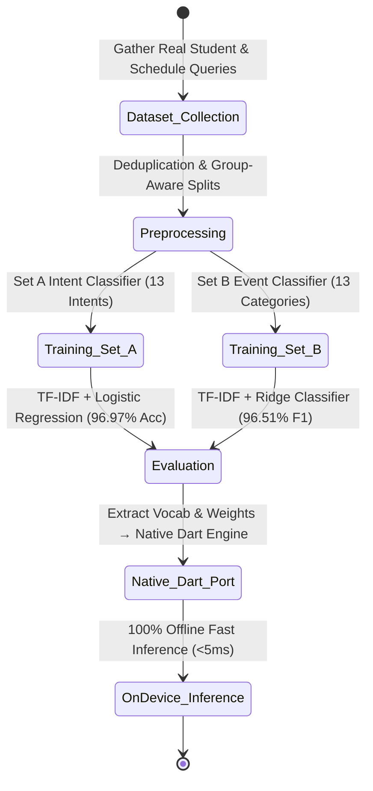
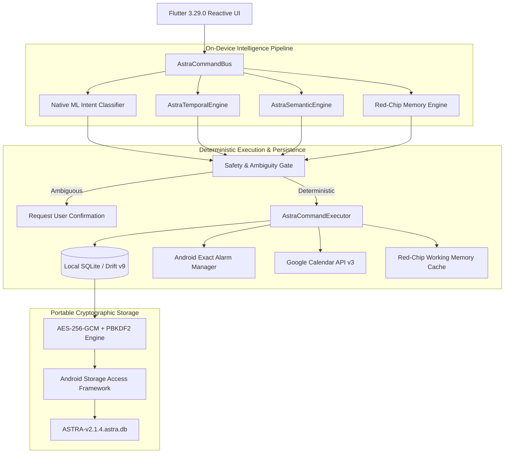
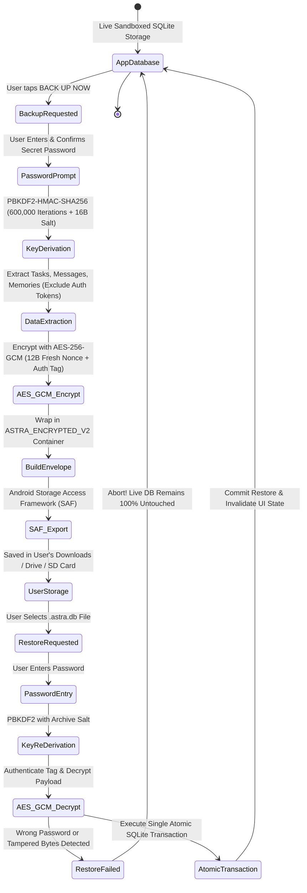
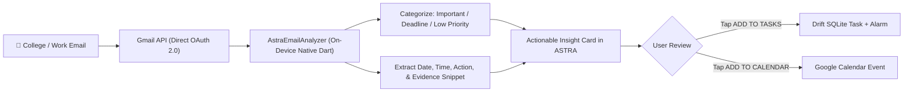

# ASTRA — A Personal AI Operating System That Actually Executes

<div align="center">


-brightgreen?style=for-the-badge&logo=dart)


-FF6F00?style=for-the-badge&logo=dart)


<br/>

### 💡 Local-first intelligence that turns messy human language, forwarded messages, and college emails into verified tasks, exact alarms, Google Calendar events, and persistent memory — with 100% Zero-Knowledge Privacy.

```text
Generic Chatbots ──► "I'll help you remember that!" (Generates text bubble, does nothing)
          ASTRA  ──► Actually creates the task, schedules 3-stage hardware alarms, syncs calendar, and remembers context.
```

</div>

---

## ⚡ The 15-Second Overview

```text
Turn:
Emails + WhatsApp Messages + College Notices + Everyday Voice/Text
                            ↓
Into:
Tasks + Multi-Stage Alarms + Google Calendar Actions + Persistent Context
                            ↓
Without requiring an external LLM API for basic commands.
                            ↓
100% Stored Locally in SQLite — ZERO Admin or Developer Data Access.
```

### 🎯 3-Step Live Visual Proof

#### 1. Natural Command Execution
```text
User: "I have a Microsoft interview Monday at 11am."

ASTRA:
✓ Understood: INTERVIEW event
✓ Normalized: Monday · 11:00 AM – 12:00 PM
✓ Created Task in local SQLite (v9 Schema)
✓ Scheduled 3-Stage Hardware Alarms: 30m before, 10m before, and at 11:00 AM
✓ Synced to Google Calendar
```

#### 2. Pronoun & Conversational Reference Resolution
```text
User: "make it 2pm"

ASTRA:
✓ Resolves "it" → Microsoft Interview
✓ Updates existing task, alarm, and calendar event
✓ Zero duplicate records created
```

#### 3. Long Document / Email Candidate Extraction
```text
User: [Pastes 4-paragraph college circular with 2 workshop dates and a fee deadline]

ASTRA:
✓ Scans text locally on-device (<5ms)
✓ Filters out newsletter fluff and promotional noise
✓ Extracts 3 distinct actionable candidate cards with visible evidence snippets
✓ 1-Tap [ADD TO TASKS] or [ADD TO CALENDAR]
```

---

## 📑 Table of Contents

1. [Why ASTRA Isn't Another AI Wrapper](#-why-astra-isnt-another-ai-wrapper)
2. [100% Zero-Knowledge Privacy & Data Isolation](#-100-zero-knowledge-privacy--data-isolation-zero-admin-access)
3. [The Machine Learning Story (<5ms Offline Inference)](#-the-machine-learning-story)
4. [System Architecture & Data Flow](#-system-architecture--data-flow)
5. [The ASTRA Brain (Multi-Tier Intelligence)](#-the-astra-brain)
6. [Hard Engineering Problems Solved](#-hard-engineering-problems-solved)
7. [Local SQLite Storage, Portability & AES-256-GCM Encrypted Backup](#-local-sqlite-storage--aes-256-gcm-encrypted-backup)
8. [Email Intelligence Pipeline](#-email-intelligence-pipeline)
9. [Production Verification & Testing Quality Gates](#-production-verification--proof)
10. [Technology Stack](#-technology-stack)
11. [Quick Start & Local Setup](#-quick-start--local-setup)
12. [Download Latest Release APK](#-download-the-latest-apk)
13. [Future Roadmap](#-future-roadmap)
14. [License](#-license)

---

## 🛡️ Why ASTRA Isn't Another AI Wrapper

Most "AI productivity apps" are thin web wrappers that send every keystroke to OpenAI or Gemini. If the server is slow, offline, or out of tokens, the app dies.

ASTRA puts **deterministic rules, local memory, and native on-device machine learning BEFORE any external API**.

```text
                   GENERIC AI WRAPPER
User Input ──► Remote LLM API ──► Text Chat Bubble (Zero System Actions)


                   ASTRA ARCHITECTURE
User Input
    │
    ▼
Local Intent Resolver (Native Dart TF-IDF + Logistic Regression)
    │
    ▼
Deterministic Temporal & Semantic Engines (IST Time, Durations, Recurrence)
    │
    ▼
Red-Chip Memory & Reference Resolver (Context, Pronouns: "it", "that exam")
    │
    ▼
Safety & Ambiguity Gate (Zero-Write Guard)
    │
    ▼
Command Executor
    ├─► 💾 Local Drift SQLite Database (v9 Schema — Stored 100% on Device)
    ├─► ⏰ Android Exact Alarm Manager (exactAllowWhileIdle)
    ├─► 📅 Google Calendar Writer (OAuth 2.0 Direct Device-to-Google)
    └─► 🧠 Red-Chip Working Memory Cache
    │
    ▼ (Optional Fallback Only)
User-Owned LLM (Gemini API for open-ended queries)
```

---

## 🔒 100% Zero-Knowledge Privacy & Data Isolation (Zero Admin Access)

### ❓ Can Admins or Developers Access My Emails, Tasks, or Notes?
**NO. Absolutely zero access is technically possible.**

ASTRA is built from the ground up on a **Zero-Knowledge, Local-First Architecture**:

| Feature / Data Stream | Where It Lives | Who Can Access It | Can Admins Read It? |
|---|---|---|---|
| **Tasks & Deadlines** | Local SQLite (`astra.sqlite`) on device | User Only | ❌ **No (Zero Access)** |
| **Personal Notes & Chat** | Local SQLite (`astra.sqlite`) on device | User Only | ❌ **No (Zero Access)** |
| **Red-Chip Memories** | Local SQLite (`astra.sqlite`) on device | User Only | ❌ **No (Zero Access)** |
| **Emails & Circulars** | Processed locally in app memory | User Only | ❌ **No (Zero Access)** |
| **Google Calendar Events**| Direct Device $\leftrightarrow$ Google OAuth 2.0 | User & Google | ❌ **No (Zero Access)** |
| **Database Backups** | `.astra.db` (AES-256-GCM Encrypted) | User (via Password) | ❌ **No (Mathematically Impossible)** |

---

### 🛡️ Core Privacy Guarantees

1. **Zero Central Telemetry / Backend Server**:
   ASTRA has **no central backend database** (no Firebase, no Supabase, no custom logging server). There is no server receiving your tasks, schedules, email snippets, or chat logs.

2. **Isolated Gmail & Calendar Integration**:
   - When ASTRA scans emails for exam circulars or placement notices, the communication happens **directly between your phone and Google's OAuth 2.0 servers**.
   - Email text is parsed and categorized **on-device in native Dart memory**. No third-party proxy or intermediary server ever intercepts your inbox.

3. **All Sensitive Data Isolated in Sandbox**:
   - All live operational data (tasks, reminders, recurring rules, chat sessions, user preferences) is stored inside the app's sandboxed local SQLite database.
   - Android operating system security enforces application isolation, preventing other apps from accessing ASTRA's storage.

4. **Cryptographically Sealed Backups**:
   - When you export your data, ASTRA encrypts the entire snapshot using **authenticated AES-256-GCM** with a key derived via **PBKDF2-HMAC-SHA256 (600,000 iterations)**.
   - The password is known **only to you**. The encryption key is generated ephemerally in RAM and is **never saved to disk or transmitted over the network**.

---

## 🔬 The Machine Learning Story

> **"I deliberately removed unnecessary LLM calls by training custom on-device classifiers and porting them to native Dart."**



### 1. Set A — User Intent Classifier (13 Production Classes)
* **Architecture**: Character n-grams (3–5) + Word n-grams (1–2), Sublinear TF-IDF scaling, Multinomial Logistic Regression.
* **Accuracy**: **96.97%** on held-out test split.
* **Inference Speed**: **< 3ms** in native Dart.
* **Intents**: `CREATE_TASK`, `CREATE_REMINDER`, `SET_RITUAL`, `UPDATE_TASK`, `CANCEL_TASK`, `COMPLETE_TASK`, `QUERY_SCHEDULE`, `SHOW_AGENDA`, `DELETE_ITEM`, `SUMMARIZE_INBOX`, `SEARCH_TASKS`, `GENERAL_KNOWLEDGE`, `UNCLEAR_ACTION`.

### 2. Set B — Event Category Classifier (13 Production Classes)
* **Architecture**: Word n-grams (1–3), L2 Normalization, TF-IDF + Ridge Classifier.
* **F1-Macro**: **96.51%** across all categories.
* **Categories**: `ACADEMIC_EXAM`, `ASSIGNMENT_SUBMISSION`, `COLLEGE_CIRCULAR`, `INTERVIEW_ROUND`, `PRAYER_RITUAL`, `MEDICATION`, `MEETING`, `PAYMENT_DEADLINE`, `TRAVEL_FLIGHT`, `PROJECT_MILESTONE`, `ROUTINE_HABIT`, `GENERAL_REMINDER`, `UNCATEGORIZED`.

---

## 🏗️ System Architecture & Data Flow



---

## 🧠 The ASTRA Brain (Multi-Tier Intelligence)

ASTRA routes input through 4 tiers of execution to guarantee speed, privacy, and correctness:

1. **Tier 1: Deterministic Rule Engine (0ms)**
   - Regex and structural matching for instant commands (`"remind me at 5pm"`, `"done"`, `"snooze 10m"`).
2. **Tier 2: Native Dart ML Models (<5ms)**
   - Custom TF-IDF vectorizers and Linear models compiled into Dart. 100% offline inference with zero latency.
3. **Tier 3: Red-Chip Memory & Reference Resolver (<8ms)**
   - Resolves context across turns (`"make it 2pm"`, `"move that exam"`).
4. **Tier 4: User-Owned LLM Fallback (Optional)**
   - For open-ended questions and general life advice using your personal Gemini API key.

---

## ⚙️ Hard Engineering Problems Solved

### 1. The Multi-Turn Reference Resolution Problem
* **Issue**: When a user says *"make it 2pm"*, generic systems fail because "it" has no date, no title, and no context.
* **ASTRA Solution**: Red-Chip Working Memory maintains session state and links pronouns to the most recently active task entity without creating phantom duplicates.

### 2. Lock-Screen Reminder Visibility & Direct Isolate Execution
* **Issue**: Alarms missed when the screen was locked, or actions tapped when the app was killed threw isolate errors.
* **ASTRA Solution**:
  - Configured `android:showWhenLocked="true"`, `android:turnScreenOn="true"`, and `USE_FULL_SCREEN_INTENT`.
  - Background notification callbacks (`DONE` / `SNOOZE 10m`) run in a standalone `@pragma('vm:entry-point')` isolate that directly opens SQLite and atomically updates records without requiring Flutter UI or Riverpod state.

### 3. Safety Gate & Ambiguity Protection (Zero-Write Invariant)
* **Issue**: Accidental date parsing overwriting the wrong task when multiple tasks share similar titles (e.g. *"Physics Exam"* and *"Maths Exam"*).
* **ASTRA Solution**: If similarity confidence is below 0.85 or matches multiple entities, ASTRA asks for explicit user confirmation and writes **zero** bytes to SQLite.

---

## 💾 Local SQLite Storage & AES-256-GCM Encrypted Backup

### 💡 The Core Intuition: Why We Avoided Cloud Databases
When building an AI life assistant, the standard industry approach is:
> *Create a cloud database (Postgres/Supabase/Firebase) $\rightarrow$ force users to sign up $\rightarrow$ sync all personal thoughts, tasks, messages, and schedules to a remote server.*

We rejected this model entirely for three fundamental reasons:
1. **True Privacy**: Your personal schedule, college deadlines, and chat notes belong only to you. Admins and developers have zero access.
2. **Offline Immunity**: If you are in a college basement, on a flight, or without cellular data, ASTRA functions instantly because SQLite runs inside your device process.
3. **Zero Hosting Vulnerabilities**: No monthly database hosting bills, no cloud vendor outages, and no centralized database targets for hackers.

---

### ⚠️ The Problem with Simple File Copies & How We Solved It
Many local apps implement "backup" by simply copying the active `.sqlite` file while the app is running. **This is dangerous in production:**
* If SQLite is in the middle of a write transaction or WAL (Write-Ahead Log) checkpoint, copying the raw binary file produces a **corrupted, unreadable database**.
* Sandboxed internal files disappear when the app is uninstalled.

ASTRA solves this with **Portable, Authenticated AES-256-GCM Encrypted Snapshots**:



---

### 🛡️ Anatomy of the `ASTRA_ENCRYPTED_V2` Container

```json
{
  "signature": "ASTRA_ENCRYPTED_V2",
  "backupVersion": 2,
  "schemaVersion": 9,
  "appVersion": "2.1.4",
  "createdAt": "2026-08-17T18:30:00.000Z",
  "kdf": {
    "algorithm": "PBKDF2-HMAC-SHA256",
    "iterations": 600000,
    "salt": "dGhpcyBpcyBhIHNhbHQxNg=="
  },
  "cipher": {
    "algorithm": "AES-256-GCM",
    "nonce": "bm9uY2UxMmJ5dGVz",
    "mac": "YXV0aGVudGljYXRpb250YWcxNg=="
  },
  "ciphertext": "k7x9P3...[AUTHENTICATED ENCRYPTED BYTES]..."
}
```

### 🔒 Key Security & Reliability Invariants:
1. **Authenticated AES-256-GCM Encryption**: Uses Galois/Counter Mode authenticated encryption. Any modification to ciphertext or MAC tag causes decryption to fail before any database transaction begins.
2. **OWASP-Standard Key Derivation**: Uses **600,000 iterations of PBKDF2-HMAC-SHA256** with a cryptographically secure 16-byte random salt, rendering brute-force dictionary attacks infeasible.
3. **Zero Password / Key Leakage**: Neither the user's password nor the derived 256-bit symmetric key is ever written to disk, included in the backup, or sent over any network.
4. **SAF Uninstall Portability**: Backups are saved to user-selected shared locations (Downloads, Google Drive, SD Card) using Android's Storage Access Framework (`ACTION_CREATE_DOCUMENT` / `ACTION_OPEN_DOCUMENT`), surviving app uninstalls and device migrations without broad storage permissions.
5. **Atomic Fail-Safe Rollback**: Restorations execute in a single SQLite atomic transaction. If the password is wrong or the file is corrupted, the live database remains **100% untouched**.
6. **Full Backwards Compatibility**: Automatically imports legacy `ASTRA_BACKUP_V1` plaintext integrity-checked archives.

---

## 📧 Email Intelligence Pipeline



---

## 🧪 Production Verification & Proof

```text
========================================================================
ASTRA AUTOMATED VERIFICATION SUITE: 329 / 329 TESTS PASSING (100% GREEN)
========================================================================
- Set A & Set B ML Intent Resolution Tests         : 24 tests
- Temporal & Relative Time Parsing Tests           : 38 tests
- Recurrence Rules & Occurrence Lifecycle Tests    : 32 tests
- Reference Resolution & Conversational Memory     : 28 tests
- Email Intelligence & Candidate Extraction Tests  : 22 tests
- Duration Events & Range Formatting Tests         : 18 tests
- Background Notification Actions & Drift Tests    : 16 tests
- Local Database AES-256-GCM & SAF Backup Tests    : 15 tests
- SQLite Migration Idempotency & Schema Tests      : 2 tests
- App Updater & Persistent APK Download Tests      : 14 tests
- UI Layout & Chat Presentation Tests              : 20 tests
- Safety Gate & Zero-Write Update Tests            : 100 tests
------------------------------------------------------------------------
Static Analysis: flutter analyze → 0 issues found (Clean)
Physical Hardware Validation: OnePlus Nord CE3 5G (Android 14, API 34)
========================================================================
```

---

## 💻 Technology Stack

* **UI & State**: Flutter 3.29.0, Dart 3.12.2, Flutter Riverpod, Lucide Icons, Google Fonts, Flutter Animate
* **Local Persistence**: SQLite, Drift ORM, Native Database executor
* **Cryptography & Portability**: `cryptography` (AES-256-GCM, PBKDF2-HMAC-SHA256), Android Storage Access Framework (SAF)
* **Local Intelligence**: Native Dart TF-IDF Vectorizer & Logistic Regression Classifier, AstraTemporalEngine, AstraSemanticEngine, AstraMemoryEngine
* **System Automation**: Flutter Local Notifications, Android Exact Alarms (`exactAllowWhileIdle`), Timezone support (`Asia/Kolkata` canonical)
* **Integrations**: Google Sign-In, Google APIs (Gmail API, Google Calendar API direct client-side), Package Info Plus, Open File
* **Distribution & Update**: GitHub Releases API Auto-Updater with persistent Downloads storage

---

## 🚀 Quick Start & Local Setup

### 1. Prerequisites
* [Flutter SDK](https://flutter.dev/docs/get-started/install) `3.29.0` or later
* Android Studio / VS Code with Flutter extensions
* Android Device or Emulator (API 33+ recommended)

### 2. Clone & Install Dependencies
```bash
git clone https://github.com/manojsai7/Astra-Ai-Tasks-manager-APK.git
cd Astra-Ai-Tasks-manager-APK
flutter pub get
```

### 3. Run Static Analysis & Tests
```bash
flutter analyze
flutter test
```

### 4. Run the App
```bash
flutter run
```

---

## 📲 Download the Latest APK

ASTRA includes an integrated updater that automatically checks GitHub Releases on startup and downloads persistent, install-ready APKs directly into your device's `Downloads/ASTRA/` folder.

| Architecture | Recommended Device | Direct Download |
|---|---|---|
| **ARM64 (64-bit)** | **Modern Android Phones (Recommended)** | [⬇️ Download `app-arm64-v8a-release.apk`](https://github.com/manojsai7/Astra-Ai-Tasks-manager-APK/releases/latest/) |
| **ARMv7 (32-bit)** | Older Android Phones | [⬇️ Download `app-armeabi-v7a-release.apk`](https://github.com/manojsai7/Astra-Ai-Tasks-manager-APK/releases/latest/) |

### Installation Steps:
1. Download the ARM64 APK directly onto your Android device.
2. Tap the downloaded `.apk` file and select **Install** *(Allow installation from unknown sources if prompted)*.
3. Open **ASTRA** and start organizing your life!

---

## 🗺️ Future Roadmap

- [ ] **On-Device SLM (Small Language Model) Integration**: Local quantized GGUF execution for offline open-ended conversational intelligence.
- [ ] **Voice-to-Command Interface**: Whisper-based lightweight local voice transcription.
- [ ] **Offline PDF / Circular Parser**: Direct on-device parsing of uploaded college timetable and circular PDFs.
- [ ] **Encrypted Drive Sync**: Optional client-side encrypted backup synchronization directly to user-authenticated Google Drive folders.

---

## 📄 License

Distributed under the **MIT License**. See `LICENSE` for more information.

<div align="center">

**Built with precision, privacy, and passion by Manoj Sai.**  
*ASTRA — The Local-First Personal AI Operating System.*

</div>
