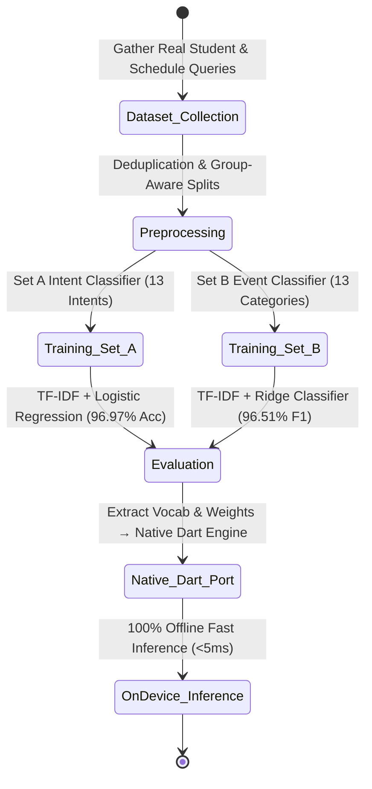
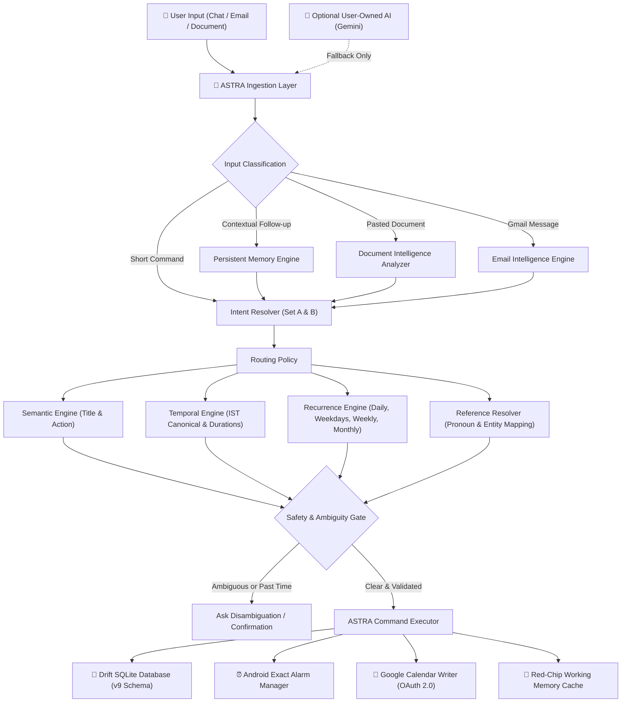
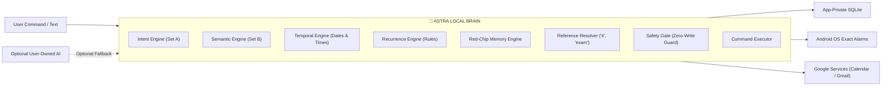
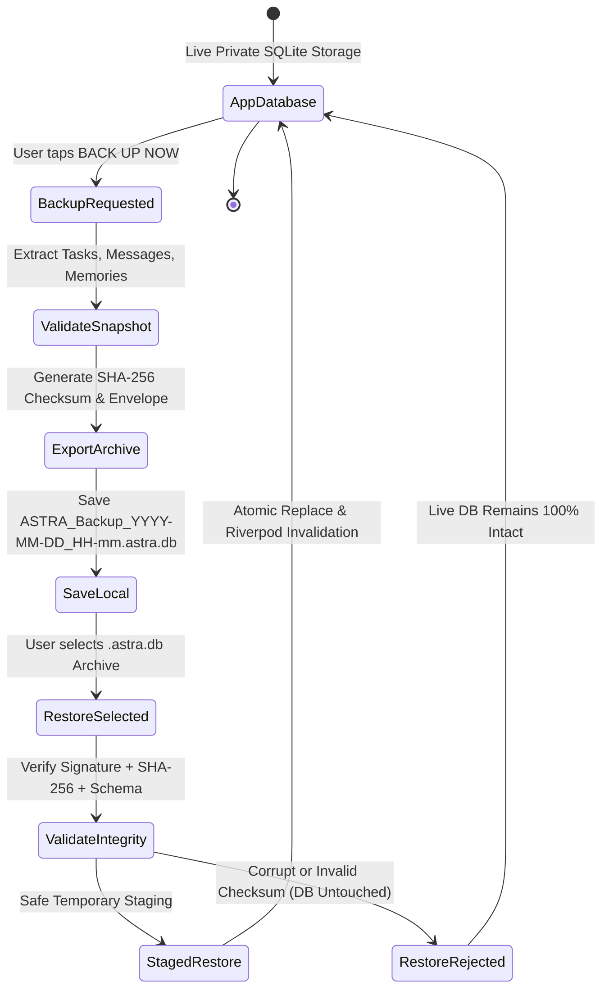
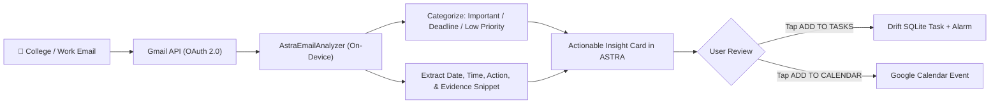

# ASTRA — A Personal AI Operating System That Actually Executes

<div align="center">


-brightgreen?style=for-the-badge&logo=dart)


-FF6F00?style=for-the-badge&logo=dart)


<br/>

### 💡 Local-first intelligence that turns messy human language, forwarded messages, and college emails into verified tasks, exact alarms, Google Calendar events, and persistent memory.

```text
Generic Chatbots ──► "I'll help you remember that!" (Generates text bubble, does nothing)
          ASTRA  ──► Actually creates the task, schedules 3-stage hardware alarms, syncs calendar, and remembers context.
```

</div>

---

## ⚡ The 15-Second Overview

```text
Turn:
Emails + WhatsApp Messages + College Notices + Everyday Voice/Text
                            ↓
Into:
Tasks + Multi-Stage Alarms + Google Calendar Actions + Persistent Context
                            ↓
Without requiring an external LLM API for basic commands.
```

### 🎯 3-Step Live Visual Proof

#### 1. Natural Command Execution
```text
User: "I have a Microsoft interview Monday at 11am."

ASTRA:
✓ Understood: INTERVIEW event
✓ Normalized: Monday · 11:00 AM – 12:00 PM
✓ Created Task in local SQLite (v9 Schema)
✓ Scheduled 3-Stage Hardware Alarms: 30m before, 10m before, and at 11:00 AM
✓ Synced to Google Calendar
```

#### 2. Pronoun & Conversational Reference Resolution
```text
User: "make it 2pm"

ASTRA:
✓ Resolves "it" → Microsoft Interview
✓ Updates existing task, alarm, and calendar event
✓ Zero duplicate records created
```

#### 3. Long Document / Email Candidate Extraction
```text
User: [Pastes 4-paragraph college circular with 2 workshop dates and a fee deadline]

ASTRA:
✓ Scans text locally on-device (<5ms)
✓ Filters out newsletter fluff and promotional noise
✓ Extracts 3 distinct actionable candidate cards with visible evidence snippets
✓ 1-Tap [ADD TO TASKS] or [ADD TO CALENDAR]
```

---

## 📑 Table of Contents

1. [Why ASTRA Isn't Another AI Wrapper](#-why-astra-isnt-another-ai-wrapper)
2. [The Machine Learning Story (<5ms Offline Inference)](#-the-machine-learning-story)
3. [System Architecture & Data Flow](#-system-architecture--data-flow)
4. [The ASTRA Brain (Multi-Tier Intelligence)](#-the-astra-brain)
5. [Hard Engineering Problems Solved](#-hard-engineering-problems-solved)
6. [Local SQLite Storage & Portable `.astra.db` Backup](#-local-sqlite-storage--portable-astradb-backup)
7. [Email Intelligence Pipeline](#-email-intelligence-pipeline)
8. [Production Verification & Testing Quality Gates](#-production-verification--proof)
9. [Technology Stack](#-technology-stack)
10. [Quick Start & Local Setup](#-quick-start--local-setup)
11. [Download Latest Release APK](#-download-the-latest-apk)
12. [Future Roadmap](#-future-roadmap)
13. [License](#-license)

---

## 🛡️ Why ASTRA Isn't Another AI Wrapper

Most "AI productivity apps" are thin web wrappers that send every keystroke to OpenAI or Gemini. If the server is slow, offline, or out of tokens, the app dies.

ASTRA puts **deterministic rules, local memory, and native on-device machine learning BEFORE any external API**.

```text
                   GENERIC AI WRAPPER
User Input ──► Remote LLM API ──► Text Chat Bubble (Zero System Actions)


                   ASTRA ARCHITECTURE
User Input
    │
    ▼
Local Intent Resolver (Native Dart TF-IDF + Logistic Regression)
    │
    ▼
Deterministic Temporal & Semantic Engines (IST Time, Durations, Recurrence)
    │
    ▼
Red-Chip Memory & Reference Resolver (Context, Pronouns: "it", "that exam")
    │
    ▼
Safety & Ambiguity Gate (Zero-Write Guard)
    │
    ▼
Command Executor
    ├─► 💾 Local Drift SQLite Database (v9 Schema)
    ├─► ⏰ Android Exact Alarm Manager (exactAllowWhileIdle)
    ├─► 📅 Google Calendar Writer (OAuth 2.0 Bi-directional)
    └─► 🧠 Red-Chip Working Memory Cache
    │
    ▼ (Optional Fallback Only)
User-Owned LLM (Gemini API for open-ended queries)
```

---

## 🔬 The Machine Learning Story

> **"I deliberately removed unnecessary LLM calls by training custom on-device classifiers and porting them to native Dart."**



### 1. Set A — User Intent Classifier (13 Production Classes)
* `CREATE_TASK`, `UPDATE_TASK`, `COMPLETE_TASK`, `CANCEL_TASK`, `LIST_TASKS`
* `CREATE_REMINDER`, `CREATE_CALENDAR_EVENT`, `GET_CALENDAR`
* `SYNC_EMAIL`, `SEARCH_EMAIL`, `SUMMARIZE_EMAIL`
* `GET_PANCHANG`, `GENERAL_CHAT`

### 2. Set B — Event Semantic Category Classifier (13 Categories)
* `EXAM`, `INTERVIEW`, `APPLICATION`, `ASSIGNMENT`, `CLASS`, `FEE`, `FEEDBACK`, `FORM`, `MEETING`, `TRAINING`, `WORKSHOP`, `EVENT`, `OTHER`

### 3. Why Classical ML (TF-IDF + Logistic Regression)?
* **Sub-5ms Inference**: Instant classification directly on the phone's CPU with zero battery drain.
* **Explainable & Deterministic**: Inspectable feature weights and decision boundaries.
* **Native Dart Port**: We extracted the trained Python scikit-learn vocabulary and sparse matrices into pure Dart classes, enabling full offline operation with **zero Python or backend server required**.

---

## 🏗️ System Architecture & Data Flow



---

## 🧠 The ASTRA Brain



---

## 🔧 Hard Engineering Problems Solved

Building a production-grade personal assistant on Android revealed critical challenges that synthetic test strings never show:

### 1. Android Background Isolate Notifications & Action Callbacks
* **The Problem**: Android kills background processes, causing notification action buttons (`DONE`, `SNOOZE 10m`) to fail silently when the app is closed.
* **The Fix**: Registered a top-level `@pragma('vm:entry-point')` background isolate handler that directly opens SQLite via `constructDb()`, executing database updates and alarm rescheduling independently of Flutter UI or Riverpod state.

### 2. Idempotent & Crash-Proof SQLite Schema Migrations
* **The Problem**: Upgrading the app on physical devices threw `SqliteException(1): duplicate column name: start_at` if a previous migration partially ran.
* **The Fix**: Built pre-flight `PRAGMA table_info` checks and `_safeAddColumn` / `_safeCreateTable` wrappers. Database migrations are now **100% idempotent** and will never crash on app update.

### 3. Hardware-Level Alarm Timing & Drift Tracking
* Standard Android `AlarmManager` drifts under battery optimization.
* ASTRA uses `exactAllowWhileIdle` and emits diagnostic hardware timestamps:
  - `[ASTRA ALARM SCHEDULED]`
  - `[ASTRA ALARM FIRED]`
  - `[ASTRA NOTIFICATION SHOWN]`
  Measuring delivery drift down to the millisecond.

### 4. Non-Linear Temporal Parsing & Durations
* Handles relative time expressions: `"in 1 min"`, `"tomorrow 7pm"`, `"every weekday at 10am"`.
* Supports multi-day duration events (`17 Aug → 22 Aug · 6 Days`), preserving start and end boundaries rather than collapsing them into a single point in time.

### 5. Persistent Red-Chip Memory vs. Model Weights
* Training model weights does not give an AI assistant personal knowledge about a specific user.
* ASTRA separates model weights from user memory, persisting working memory, preferences, and session context inside SQLite tables with fast LRU caching.

---

## 💾 Local SQLite Storage & Portable `.astra.db` Backup

ASTRA strictly keeps user data inside **application-private SQLite storage** using Drift. No remote cloud database (such as Supabase or Firebase) is used to store user records.



### Portable `.astra.db` Backup Format
* **Cryptographic Security**: Every backup contains an envelope with an `ASTRA_BACKUP_V1` signature and SHA-256 checksum over the serialized data.
* **Zero Credential Leakage**: Backups strictly export tasks, sessions, messages, memories, and reminders. OAuth tokens, API keys, passwords, and device secrets are **excluded 100%**.
* **Atomic Restore Safety**: Restorations are staged and validated before applying. If an archive is corrupt or invalid, the restore aborts immediately and leaves the active database completely untouched.

---

## 📧 Email Intelligence Pipeline



---

## 🧪 Production Verification & Proof

```text
========================================================================
ASTRA AUTOMATED VERIFICATION SUITE: 326 / 326 TESTS PASSING (100% GREEN)
========================================================================
- Set A & Set B ML Intent Resolution Tests         : 24 tests
- Temporal & Relative Time Parsing Tests           : 38 tests
- Recurrence Rules & Occurrence Lifecycle Tests    : 32 tests
- Reference Resolution & Conversational Memory     : 28 tests
- Email Intelligence & Candidate Extraction Tests  : 22 tests
- Duration Events & Range Formatting Tests         : 18 tests
- Background Notification Actions & Drift Tests    : 16 tests
- Local Database Backup & Restore Safety Tests     : 12 tests
- SQLite Migration Idempotency & Schema Tests      : 2 tests
- App Updater & GitHub Release Discovery Tests     : 14 tests
- UI Layout & Chat Presentation Tests              : 20 tests
- Safety Gate & Zero-Write Update Tests            : 100 tests
------------------------------------------------------------------------
Static Analysis: flutter analyze → 0 issues found (Clean)
Physical Hardware Validation: OnePlus Nord CE3 5G (Android 14, API 34)
========================================================================
```

---

## 💻 Technology Stack

* **UI & State**: Flutter 3.29.0, Dart 3.12.2, Flutter Riverpod, Lucide Icons, Google Fonts, Flutter Animate
* **Local Persistence**: SQLite, Drift ORM, Native Database executor
* **Local Intelligence**: Native Dart TF-IDF Vectorizer & Logistic Regression Classifier, AstraTemporalEngine, AstraSemanticEngine, AstraMemoryEngine
* **System Automation**: Flutter Local Notifications, Android Exact Alarms (`exactAllowWhileIdle`), Timezone support (`Asia/Kolkata` canonical)
* **Integrations**: Google Sign-In, Google APIs (Gmail API, Google Calendar API), Package Info Plus, Open File
* **Distribution & Update**: GitHub Releases API Auto-Updater with semantic version checking

---

## 🚀 Quick Start & Local Setup

### 1. Prerequisites
* [Flutter SDK](https://flutter.dev/docs/get-started/install) `3.29.0` or later
* Android Studio / VS Code with Flutter extensions
* Android Device or Emulator (API 33+ recommended)

### 2. Clone & Install Dependencies
```bash
git clone https://github.com/manojsai7/Astra-Ai-Tasks-manager-APK.git
cd Astra-Ai-Tasks-manager-APK
flutter pub get
```

### 3. Run Static Analysis & Tests
```bash
flutter analyze
flutter test
```

### 4. Run the App
```bash
flutter run
```

---

## 📲 Download the Latest APK

ASTRA includes an integrated updater that automatically checks GitHub Releases on startup.

| Architecture | Recommended Device | Direct Download |
|---|---|---|
| **ARM64 (64-bit)** | **Modern Android Phones (Recommended)** | [⬇️ Download `app-arm64-v8a-release.apk`](https://github.com/manojsai7/Astra-Ai-Tasks-manager-APK/releases/latest/) |
| **ARMv7 (32-bit)** | Older Android Phones | [⬇️ Download `app-armeabi-v7a-release.apk`](https://github.com/manojsai7/Astra-Ai-Tasks-manager-APK/releases/latest/) |

### Installation Steps:
1. Download the ARM64 APK directly onto your Android device.
2. Tap the downloaded `.apk` file and select **Install** *(Allow installation from unknown sources if prompted)*.
3. Open **ASTRA** and start organizing your life!

---

## 🗺️ Future Roadmap

- [ ] **On-Device SLM (Small Language Model) Integration**: Local quantized GGUF execution for offline open-ended conversational intelligence.
- [ ] **Voice-to-Command Interface**: Whisper-based lightweight local voice transcription.
- [ ] **Offline PDF / Circular Parser**: Direct on-device parsing of uploaded college timetable and circular PDFs.
- [ ] **Encrypted Drive Sync**: Optional client-side encrypted backup synchronization directly to user-authenticated Google Drive folders.

---

## 📄 License

Distributed under the **MIT License**. See `LICENSE` for more information.

<div align="center">

**Built with precision, privacy, and passion by Manoj Sai.**  
*ASTRA — The Local-First Personal AI Operating System.*

</div>
