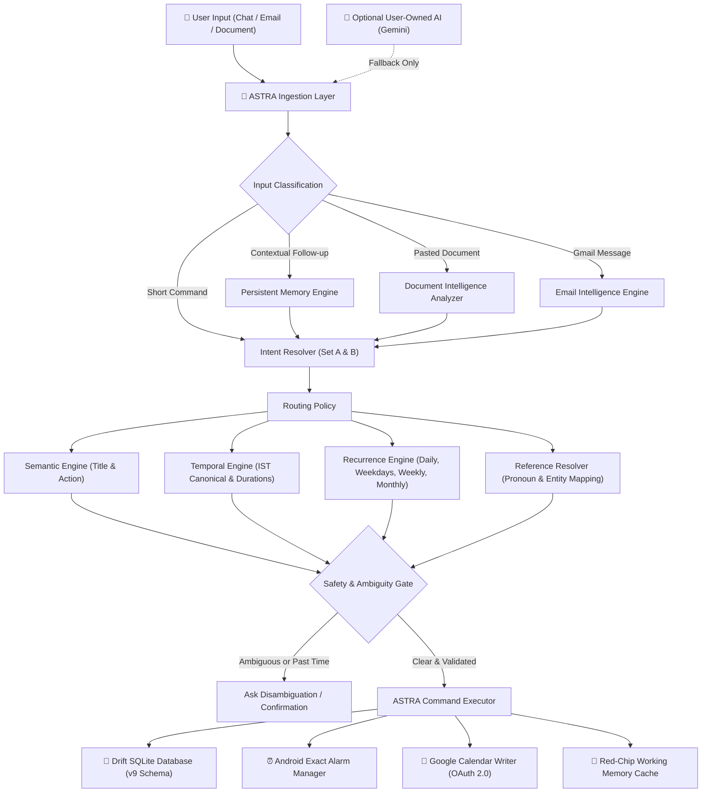
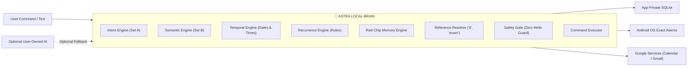
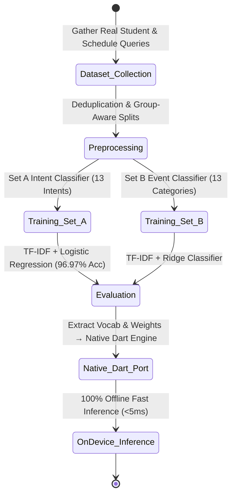
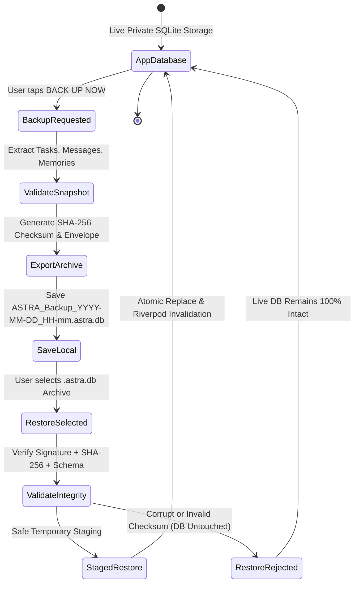
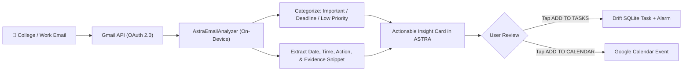

# ASTRA — The Local-First Personal AI Operating System

<div align="center">


-brightgreen?style=for-the-badge&logo=dart)


<br/>

**A privacy-first personal assistant that turns scattered emails, forwarded WhatsApp messages, college circulars, and everyday conversations into actionable tasks, exact reminders, and Google Calendar events — directly on your device.**

</div>

---

## 📑 Table of Contents

1. [The Real-World Problem: Information is Scattered Everywhere](#the-real-world-problem-information-is-scattered-everywhere)
2. [What is ASTRA? — Natural Language to Real Execution](#what-is-astra--natural-language-to-real-execution)
3. [What Makes ASTRA Different?](#what-makes-astra-different)
4. [System Architecture & Data Flow](#system-architecture--data-flow)
5. [The ASTRA Brain (Multi-Tier Intelligence)](#the-astra-brain)
6. [The Machine Learning Journey (From Python to Native Dart)](#the-machine-learning-journey)
7. [Engineering Challenges & Hard Lessons Learned](#engineering-challenges--hard-lessons-learned)
8. [Local SQLite Storage & Portable `.astra.db` Backup](#local-sqlite-storage--portable-astradb-backup)
9. [Email Intelligence Pipeline (Email → Task → Calendar)](#email-intelligence-pipeline)
10. [Testing Methods & Quality Gates](#testing-methods--quality-gates)
11. [Privacy & Security by Design](#privacy--security-by-design)
12. [Technology Stack](#technology-stack)
13. [Who is ASTRA For?](#who-is-astra-for)
14. [How to Use ASTRA Effectively](#how-to-use-astra-effectively)
15. [Quick Start & Local Setup](#quick-start--local-setup)
16. [Download Latest Release APK](#download-the-latest-apk)
17. [Future Roadmap](#future-roadmap)
18. [License](#license)

---

## The Real-World Problem: Information is Scattered Everywhere

Think about how an average day starts for a student or working professional:

* You wake up to **12 WhatsApp group messages** announcing that an assignment deadline moved to Friday 5 PM.
* A **college email** arrives with a 4-paragraph circular about placement registration closing tomorrow night.
* A friend texts on Telegram: *"Bro, don't forget to submit the lab record before 3 PM today."*
* You have a technical interview next Monday, but the timing is buried inside an email thread from last week.

### What do people usually do?
1. **Take screenshots** that get buried under hundreds of photos.
2. **Star emails** that get forgotten under incoming promotional newsletters.
3. **Use traditional task managers** (Todoist, Notion, Google Tasks), but typing titles, picking dates from time wheels, and setting alarms manually is too slow and tedious.
4. **Use AI chatbots** (ChatGPT, Claude), which understand the text, but **cannot actually do anything on your phone**—they cannot insert SQLite rows, schedule Android alarms, or update your calendar.

The problem isn't a lack of tools.  
**The problem is that your life is scattered across 10 apps, and no tool bridges the gap between understanding natural text and executing real actions on your phone.**

---

## What is ASTRA? — Natural Language to Real Execution

ASTRA is built around one simple idea:

> **You should be able to speak, forward, or paste anything naturally, and your phone should just handle it.**

### Example 1: A Natural Command
```text
You say: "I have a Microsoft interview Monday at 11am."

ASTRA does:
1. Understands the intent (Interview Event).
2. Normalizes the exact date and time (Monday · 11:00 AM – 12:00 PM).
3. Saves a persistent Task in your local SQLite database.
4. Schedules a 3-stage exact hardware alarm (30m before, 10m before, and at 11:00 AM).
5. Syncs the event directly to your Google Calendar.
```

### Example 2: Conversational Memory & Context
```text
You say: "make it 2pm"

ASTRA does:
- Recognizes that "it" refers to the Microsoft Interview.
- Updates the existing task, alarm, and calendar event.
- Zero duplicate records created.
```

### Example 3: Pasting a Long College Notice
```text
You paste a 3-paragraph college notice with 2 workshop dates and a fee deadline.

ASTRA does:
- Scans the document locally on your phone.
- Filters out newsletter boilerplate and promotional text.
- Extracts distinct candidate cards with exact dates and visible evidence snippets.
- Lets you add them to your tasks or calendar with a single tap.
```

---

## What Makes ASTRA Different?

| Feature | Generic Chatbots / LLM Wrappers | Traditional Task Apps | ASTRA |
|---|---|---|---|
| **Where Intelligence Runs** | 100% Cloud Server Required | None (Manual Entry) | **Local-First On-Device Brain + Native Dart ML** |
| **Data Privacy** | Messages sent to remote servers | Cloud or Local DB | **100% On-Device SQLite (No Cloud DB / Supabase)** |
| **Conversational Memory** | Session resets or server-dependent | No memory | **Persistent Red-Chip Working & Entity Memory** |
| **Pronoun / Context Resolution** | Generic token prediction | Not Supported | **Deterministic Reference Engine (`"it"`, `"that exam"`)** |
| **Temporal Parsing** | Inconsistent / Hallucinatory | Strict Date Pickers | **Deterministic Engine (`"in 1 min"`, `"tomorrow 7pm"`, durations)** |
| **Recurrence Engine** | Requires explicit Cron/API | Static repetition rules | **Logical Recurrence (Advances next occurrence, zero DB bloat)** |
| **Multi-Stage Reminders** | Single notification | Single alarm | **Early-warning alarm chains (30m, 10m, 0m on single task)** |
| **Document / Email Intake** | Summarizes text only | Not Supported | **Extracts multi-candidate actionable cards with evidence** |
| **Data Portability** | Locked into proprietary cloud | Basic CSV Export | **Cryptographic `.astra.db` snapshot for your personal drive** |

---

## System Architecture & Data Flow

ASTRA features an intentionally layered architecture where deterministic logic, safety gates, and local models precede any optional network calls.



---

## The ASTRA Brain

ASTRA separates model intelligence from user memory and execution. External generative AI is strictly an enhancement, never a hard requirement for core task and reminder operations.



---

## The Machine Learning Journey

Instead of bundling a massive black-box model or relying on continuous API calls, we built and trained custom classifiers specifically for scheduling and event understanding.



### 1. Set A — User Intent Classifier (13 Production Classes)
* `CREATE_TASK`, `UPDATE_TASK`, `COMPLETE_TASK`, `CANCEL_TASK`, `LIST_TASKS`
* `CREATE_REMINDER`, `CREATE_CALENDAR_EVENT`, `GET_CALENDAR`
* `SYNC_EMAIL`, `SEARCH_EMAIL`, `SUMMARIZE_EMAIL`
* `GET_PANCHANG`, `GENERAL_CHAT`

### 2. Set B — Event Category Classifier (13 Semantic Categories)
* `EXAM`, `INTERVIEW`, `APPLICATION`, `ASSIGNMENT`, `CLASS`, `FEE`, `FEEDBACK`, `FORM`, `MEETING`, `TRAINING`, `WORKSHOP`, `EVENT`, `OTHER`

### 3. Why Classical ML (TF-IDF + Logistic Regression)?
* **Sub-5ms Inference**: Lightning fast execution directly on mobile hardware.
* **Explainable & Deterministic**: Inspectable feature weights and decision boundaries.
* **Zero Backend Dependency**: Exported vocabulary and weights were migrated into a **pure native Dart inference implementation**, completely eliminating the need for a background Python server.

---

## Engineering Challenges & Hard Lessons Learned

Building a real-world personal assistant exposed edge cases that synthetic test strings never show:

### 1. Model Accuracy Alone Is Not Enough
A classifier can achieve 97% accuracy on a dataset and still misinterpret `"show my schedule"` (which could mean `GET_CALENDAR` or `LIST_TASKS`). ASTRA pairs ML predictions with confidence scoring and deterministic safety gates.

### 2. Memory Belongs in Persistent Storage, Not Model Weights
Training model weights does not give an assistant long-term memory about an individual user. ASTRA maintains a structured **Red-Chip Memory layer** inside Drift SQLite that persists working context, entities, preferences, and session history across app restarts.

### 3. Human Time Expressions Are Non-Linear
Users express time in dozens of natural ways: `"in 1 min"`, `"next minute"`, `"tomorrow 7pm"`, `"6 20pm"`, `"18:20"`, `"every weekday at 10am"`. A dedicated temporal normalization engine resolves these into canonical timestamps and prevents accidental past-time scheduling.

### 4. Background Alarm Execution on Modern Android
Creating a SQLite row is not enough. Android 13+ battery optimizations and OEM sleep policies can silence alarms. We implemented:
* Foreground and background isolate callbacks (`@pragma('vm:entry-point')`).
* Exact alarm permissions (`exactAllowWhileIdle`).
* Real-time drift diagnostics (`[ASTRA ALARM FIRED]` vs `[ASTRA NOTIFICATION SHOWN]`) measuring hardware delivery timing to within milliseconds.

### 5. Multi-Candidate Document Extraction
A 5-paragraph college circular or placement email can contain 3 different dates, 2 workshops, and 1 fee deadline. ASTRA avoids reducing an entire document to a single task by extracting multiple structured candidates with visible evidence phrases.

---

## Local SQLite Storage & Portable `.astra.db` Backup

ASTRA strictly keeps user data inside **application-private SQLite storage** using Drift. No remote cloud database (such as Supabase or Firebase) is used to store user records.



### Portable `.astra.db` Backup Format
* **Cryptographic Security**: Every backup contains an envelope with an `ASTRA_BACKUP_V1` signature and SHA-256 checksum over the serialized data.
* **Zero Credential Leakage**: Backups strictly export tasks, sessions, messages, memories, and reminders. OAuth tokens, API keys, passwords, and device secrets are **excluded 100%**.
* **Atomic Restore Safety**: Restorations are staged and validated before applying. If an archive is corrupt or invalid, the restore aborts immediately and leaves the active database completely untouched.

---

## Email Intelligence Pipeline



---

## Testing Methods & Quality Gates

ASTRA enforces a strict multi-tier verification process across unit, integration, and on-device hardware tests:

```text
========================================================================
ASTRA AUTOMATED VERIFICATION SUITE: 326 / 326 TESTS PASSING (100% GREEN)
========================================================================
- Set A & Set B ML Intent Resolution Tests         : 24 tests
- Temporal & Relative Time Parsing Tests           : 38 tests
- Recurrence Rules & Occurrence Lifecycle Tests    : 32 tests
- Reference Resolution & Conversational Memory     : 28 tests
- Email Intelligence & Candidate Extraction Tests  : 22 tests
- Duration Events & Range Formatting Tests         : 18 tests
- Background Notification Actions & Drift Tests    : 16 tests
- Local Database Backup & Restore Safety Tests     : 12 tests
- SQLite Migration Idempotency & Schema Tests      : 2 tests
- App Updater & GitHub Release Discovery Tests     : 14 tests
- UI Layout & Chat Presentation Tests              : 20 tests
- Safety Gate & Zero-Write Update Tests            : 100 tests
------------------------------------------------------------------------
Static Analysis: flutter analyze → 0 issues found (Clean)
Physical Device Acceptance: Verified on OnePlus Nord CE3 5G (Android 14)
========================================================================
```

---

## Privacy & Security by Design

* **Zero Mandatory Cloud Database**: Your tasks, thoughts, schedules, and chat history remain solely on your device.
* **User-Owned API Keys**: If you choose to enable external generative AI, you provide your own personal Gemini API key stored securely in app preferences.
* **Zero Telemetry / Zero Tracking**: No tracking SDKs, analytics beacons, or third-party loggers are bundled.
* **No Broad Storage Permissions**: Backups utilize system document intents and application storage without requiring risky `MANAGE_EXTERNAL_STORAGE` permissions.

---

## Technology Stack

* **Framework & UI**: Flutter 3.29.0, Dart 3.12.2, Flutter Riverpod, Lucide Icons, Google Fonts, Flutter Animate
* **Local Persistence**: SQLite, Drift ORM, Native Database executor
* **Local Intelligence**: Native Dart TF-IDF Vectorizer & Logistic Regression Classifier, AstraTemporalEngine, AstraSemanticEngine, AstraMemoryEngine
* **System Automation**: Flutter Local Notifications, Android Exact Alarms (`exactAllowWhileIdle`), Timezone support (`Asia/Kolkata` canonical)
* **Integrations**: Google Sign-In, Google APIs (Gmail API, Google Calendar API), Package Info Plus, Open File
* **Distribution & Update**: GitHub Releases API Auto-Updater with semantic version checking

---

## Who is ASTRA For?

* 🎓 **Students**: Tracking continuous assignment deadlines, exam timetables, fee due-dates, and placement interviews without getting lost in WhatsApp group chats.
* 💻 **Engineers & Professionals**: Handling standups, multi-day conferences, interview scheduling, and inbox action items.
* 🧘 **Anyone Seeking Clarity**: Those who want a fast, respectful, local-first assistant that respects personal privacy and works without constant internet connectivity.

---

## How to Use ASTRA Effectively

### 1. Natural Task & Reminder Commands
* `"I have a physics lab tomorrow at 10am."`
* `"Remind me to submit the assignment in 15 minutes."`
* `"Pay hostel fee by Friday 5pm."`

### 2. Contextual Follow-ups & Multi-Turn Updates
* User: `"I have a mock interview on Tuesday at 4pm."`
* ASTRA: `"Got it! Mock interview scheduled for Tuesday at 4:00 PM."`
* User: `"make it 6pm instead"`
* ASTRA: `"Updated Mock interview to Tuesday at 6:00 PM."`

### 3. Recurring Schedules & Habits
* `"Study algorithms every weekday from 8pm to 10pm."`
* `"Weekly sync every Monday at 11am."`

### 4. Pasting Long Documents / Circulars
Simply paste the complete text of an email, assignment notice, or training schedule. ASTRA will automatically parse the content, extract key dates and actions, and present clean candidate cards for one-tap task or calendar creation.

### 5. Managing Backups
Navigate to **Profile Sheet $\rightarrow$ Data & Privacy $\rightarrow$ Backup ASTRA Data** to generate a cryptographic `.astra.db` file and export it to your Google Drive or computer.

---

## Quick Start & Local Setup

### 1. Prerequisites
* [Flutter SDK](https://flutter.dev/docs/get-started/install) `3.29.0` or later
* Android Studio / VS Code with Flutter extensions
* Android Device or Emulator (API 33+ recommended)

### 2. Clone & Install Dependencies
```bash
git clone https://github.com/manojsai7/Ai-Tasks-manager.git
cd Ai-Tasks-manager
flutter pub get
```

### 3. Run Static Analysis & Tests
```bash
flutter analyze
flutter test
```

### 4. Run the App
```bash
flutter run
```

---

## Download the Latest APK

ASTRA includes an integrated updater that automatically checks GitHub Releases on startup.

| Architecture | Recommended Device | Direct Download |
|---|---|---|
| **ARM64 (64-bit)** | **Modern Android Phones (Recommended)** | [⬇️ Download `app-arm64-v8a-release.apk`](https://github.com/manojsai7/Ai-Tasks-manager/releases/latest/) |
| **ARMv7 (32-bit)** | Older Android Phones | [⬇️ Download `app-armeabi-v7a-release.apk`](https://github.com/manojsai7/Ai-Tasks-manager/releases/latest/) |

### Installation Steps:
1. Download the ARM64 APK directly onto your Android device.
2. Tap the downloaded `.apk` file and select **Install** *(Allow installation from unknown sources if prompted)*.
3. Open **ASTRA** and start organizing your life!

---

## Future Roadmap

- [ ] **On-Device SLM (Small Language Model) Integration**: Local quantized GGUF execution for offline open-ended conversational intelligence.
- [ ] **Voice-to-Command Interface**: Whisper-based lightweight local voice transcription.
- [ ] **Offline PDF / Circular Parser**: Direct on-device parsing of uploaded college timetable and circular PDFs.
- [ ] **Encrypted Drive Sync**: Optional client-side encrypted backup synchronization directly to user-authenticated Google Drive folders.

---

## License

Distributed under the **MIT License**. See `LICENSE` for more information.

<div align="center">

**Built with precision, privacy, and passion by Manoj Sai.**  
*ASTRA — The Local-First Personal AI Operating System.*

</div>
